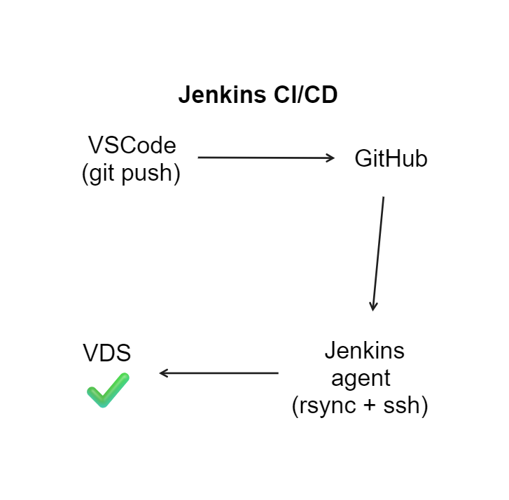

# Jenkins CI/CD pipeline

Для отправки проекта на сервер, используется rsync в связке с ssh, который служит для авторизации.

**Важное замечание: здесь идет речь о ситуации, когда Jenkins и ваш проект находятся на разных серверах**



## Инструкция

Для начала необходимо создать private ssh key, который будет авторизовывать Jenkins при отправке файлов на конечный сервер.

Далее нужно добавить этот приватный ключ в Jenkins, делается это во вкладке _Credentials_. После этого мы сможем использовать этот приватный ключ внутри нашего pipeline.

Я покажу **два** способа использования приватного ssh ключа в Jenkins pipeline:

1.  Нативный (без использования плагинов Jenkins)
2.  С помощью плагина SSHAgent

---

## 1. Нативный (без использования плагинов Jenkins)

Pipeline будет выглядеть следующим образом:

```
pipeline {
   agent any
   options {
      // Пропустит стадии выполенения pipeline, если появятся ошибки при выполнении
      skipStagesAfterUnstable()
   }
   stages {
      stage('Test') {
         steps {

            withCredentials([sshUserPrivateKey(credentialsId: 'ТУТ-ID-Credentials', keyFileVariable: 'keyfile')]) {
               sh 'rsync -e "ssh -i ${keyfile} -o StrictHostKeyChecking=no" -avz . "user@host.ru:~/test-cicd"'

               sh '''ssh -i ${keyfile} -o StrictHostKeyChecking=no -tt user@host.ru << EOF
                       uptime
                       pwd
                       ls -al
                       exit
               EOF'''
            }
         }
      }
   }
}

```

Здесь идет работа с предустановленным плагином [Credentials Binding Plugin](https://www.jenkins.io/doc/pipeline/steps/credentials-binding/). Он предоставляет нам конструкцию `withCredentials`, передаем ему binding `sshUserPrivateKey`, который позволит передать наш приватный ключ

```
withCredentials([sshUserPrivateKey(credentialsId: 'ТУТ-ID-Credentials', keyFileVariable: 'keyfile')])
{
	// Здесь будет доступна переменная keyfile с нашем приватным ключом, пример:
	echo ${keyfile} // выведет в терминал значение приватного ключа
}
```

**rsync** — программа для UNIX-подобных систем, которая эффективно выполняет синхронизацию файлов и каталогов в двух местах с минимизированием трафика, используя кодирование данных при необходимости. Важным отличием rsync от многих других программ/протоколов является то, что зеркалирование осуществляется одним потоком в каждом направлении.

Флаги, которые используются:

- -a архивирует передаваемые данные
- -v подробно отображает информацию о передаче
- -z сжимает передаваемые данные
- -e указание использования удаленной оболочки (в нашем случае SSH)

Таким образом, чтобы использовать rsync в связке с ssh, нужно передать флаг `-e "ssh -i ${keyfile} -o StrictHostKeyChecking=no"`

## 2. С помощью плагина SSHAgent

```
pipeline {
   agent any
   options {
      // Пропустит стадии выполенения pipeline, если появятся ошибки при выполнении
      skipStagesAfterUnstable()
   }
   stages {
      stage('Test') {
         steps {
            sshagent(['ТУТ-ID-Credentials']) {
               sh 'rsync -e "ssh -o StrictHostKeyChecking=no" -avz . "user@host.ru:~/test-cicd"'

               sh '''ssh -o StrictHostKeyChecking=no -tt user@host.ru << EOF
                       uptime
                       pwd
                       ls -al
                       exit
               EOF'''
            }
         }
      }
   }
}

```

Принцип работы pipeline остается тот же, но теперь нам не надо передавать везде приватный ключ, за нас это делает теперь SSHAgent.

---

# Запуск команд на удаленном сервере

Для того чтобы выполнять команды на сервере из нашего pipeline, мы будем использовать тот же _SSH_. В примерах приведенных выше, есть такая команда:

```
sh '''ssh -o StrictHostKeyChecking=no -tt user@host.ru << EOF
                       uptime
                       pwd
                       ls -al
                       exit
               EOF'''
```

В зависимости от того, используем лм мы плагин или нет, нам при подключении по SSH придется либо передавать приватный ключ(если без плагина), либо нет (если используем плагин, т.к. ключ у нас находится в "окружении" и SSH его подхватит в тот момент когда мы будем подключаться к нашему серверу)

Вместо `uptime pwd ls -al` могут быть ваши команды, которые выполнятся на вашем СЕРВЕРЕ, а не в Jenkins. Команда `exit` является обязательной, и если не написать её, то ваш pipeline будет беконечным, т.к. сессия SSH не будет закрыта.

Решение с выполнением команд именно таким образом не явлеяется эталонным, это всего лишь одно из решений, которое просто работает. Возможно есть более лаконичные решения данной задачи.
